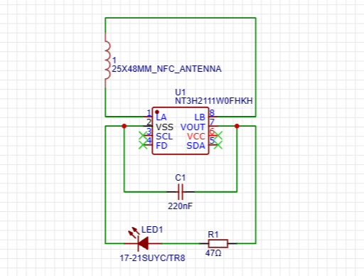
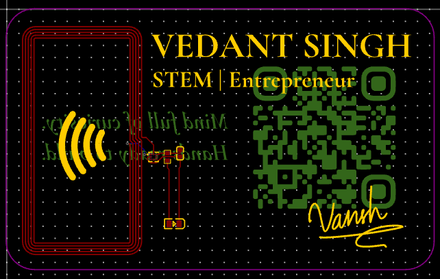
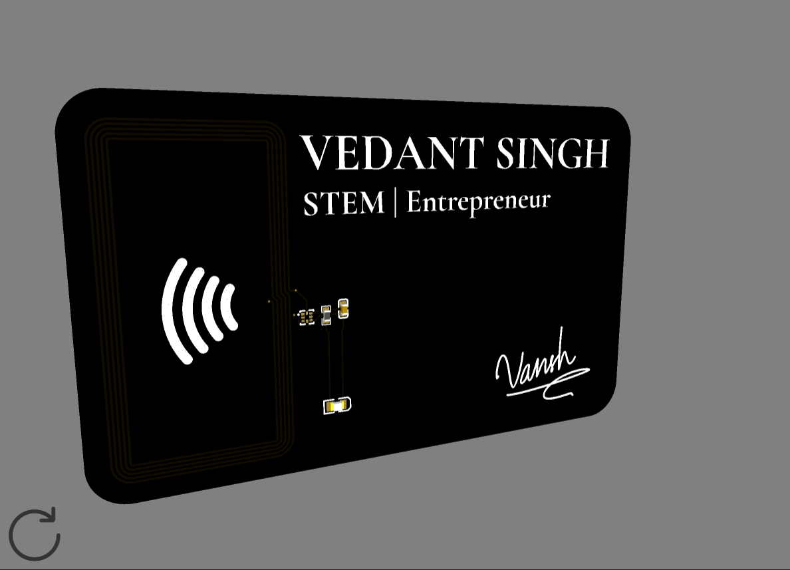
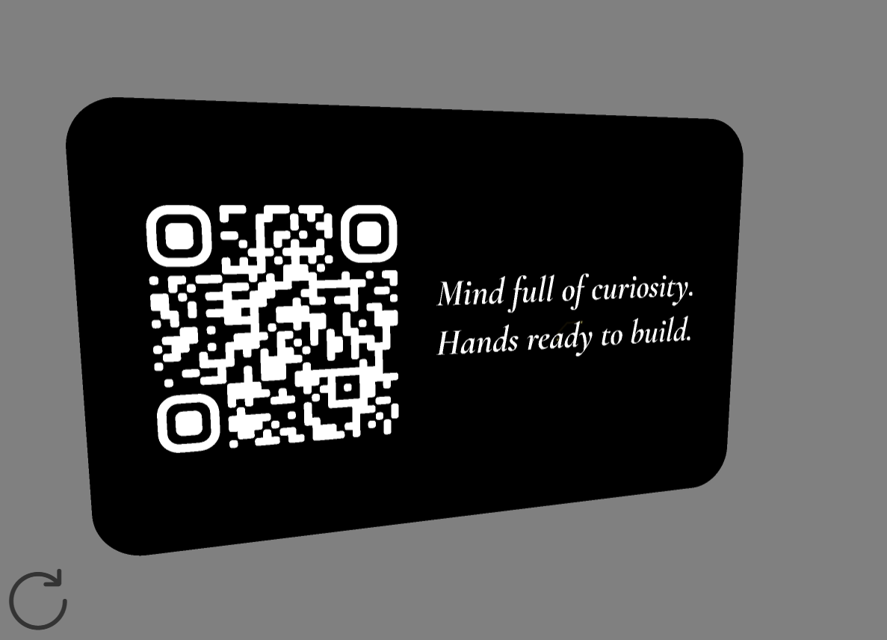

# nfc-card
This PCB card features an integrated NFC antenna. I built this to replace traditional paper cards with a sleek piece of hardware that instantly shares a digital portfolio or contact info when tapped to a compatible device.

## What is this?
This is a PCB NFC Card designed around a custom 13.56MHz copper antenna loop. The card operates as a passive **Near Field Communication (NFC) transponder**. When brought near an active NFC reader (such as a smartphone or dedicated scanner), the integrated copper coil harvests electromagnetic energy over the air to power the onboard IC. Once energized, the chip modulates the field to transmit its stored data payload wirelessly, enabling data transfers, automated logic triggering, or wireless access authentication without requiring a battery.

1] Schematic:



2] Raw PCB:



3] 3D PCB (Black, Front):



4] 3D PCB (Black, Back):



## Repository Structure

```text
nfc-card/
|
|---- Assets/-----------# Images and visual references for the project
|            -----------# (schematic diagrams, raw PCB renders, 3D PCB views)
|
|---- Hardware/---------# Source design files for the PCB
|              ---------# (EasyEDA schematics, PCB layout, Gerber files, etc)
|
|---- BOM.csv-----------# Bill of Materials
|
|---- LICENSE-----------# MIT License
|
|---- README.md---------# Project documentation and instructions
```

## How to edit the source files and get your NFC PCB Card?
1. First, download the files or clone this repository
2. Open the web interface or desktop client for EasyEDA Standard
3. Go to File > Open > EasyEDA Standard Project
4. Select and import the files from this repository to load the schematics and PCB layout
5. Hurray, edit your name and printables like a QR Code, etc you want on your silk layer (top and bottom), and export YOUR gerber.zip to JLCPCB to get a print!
6. Once you get your card shipped to you. You can write on it with a writing tool to make it fully functional.
7. You may also password-protect it to avoid overwriting. (Optional)

## Fabrication specs
If you want to order a batch of these for yourself, here is the exact recipe to use on a manufacturing unit like JLCPCB to get the same;

- Layer: 2 Layers (Do not change this to 1, or the antenna jump loop will break)
- Base Material: FR4 (1.6mm thickness)
- Solder Mask: (You can choose your preferred color)
- Silkscreen: White (Default) (Choose whatever contrasts well with your PCB color)
- Finish: HASL
- Via Covering: Via Plugged (Fills the antenna vias with black mask material to keep the surface relatively smooth)

## License
[MIT](LICENSE) - Use, Modify, Share, etc as you like!

## Notes
- Will update on how to use once I get my card shipped!
- The card in the repo has less info due to privacy, but you may add whatever you like while editing the source PCB.
- If y'all like this, you may love to see [Stardance- Luminator](https://github.com/vd-sh/luminator) and [Stardance- MP3 Player](https://github.com/vd-sh/mp3-player)
- To see my latest projects, you may visit my [profile](https://github.com/vd-sh) :)
